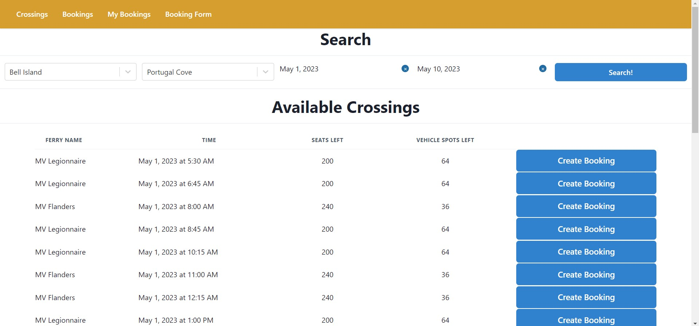
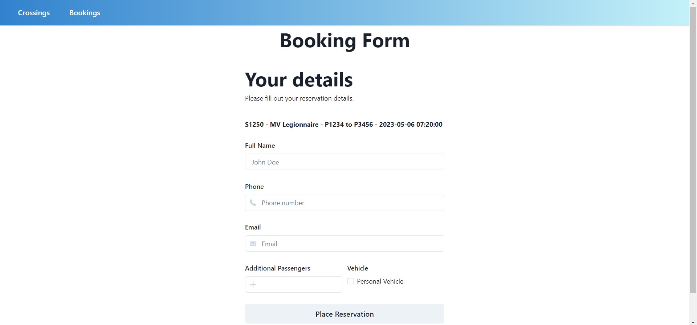
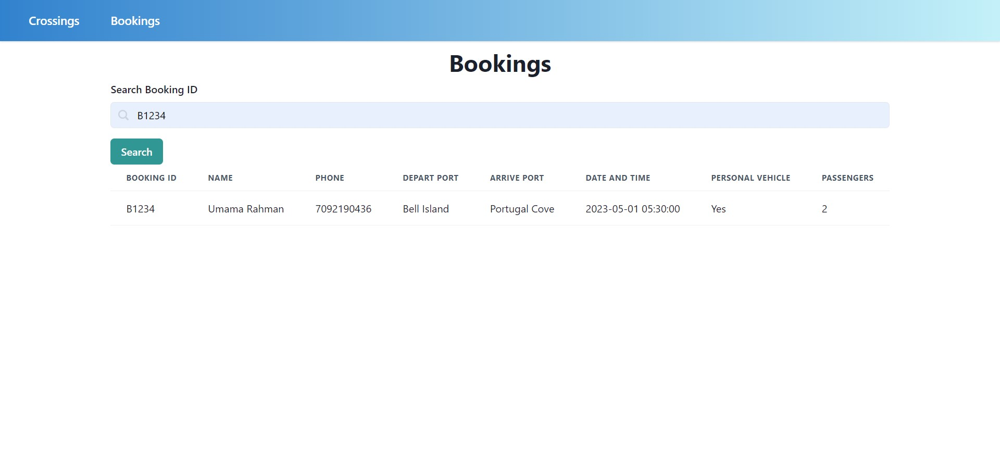

# Demo Screenshots

See screenshots and respective use case in case the project does not build on your machine.

### Crossings Page

See below the crossings page, where users can input their desired ports and dates to filter the database.

See below the booking form, which pops up when users click "Create Booking".

See below the functionality for checking a booking, using the reservation number.

