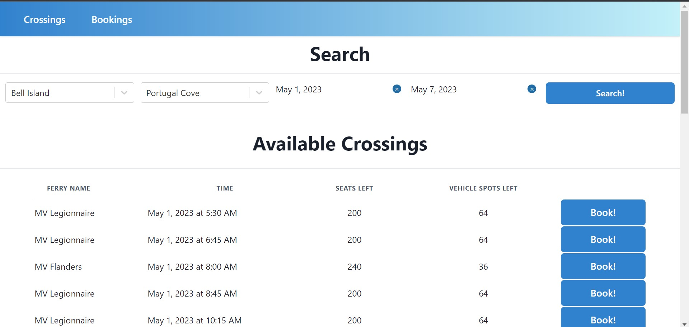
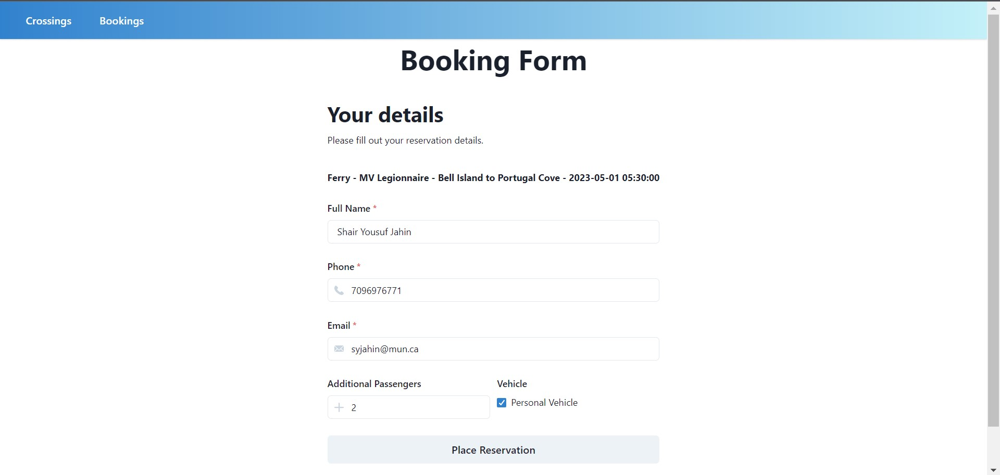
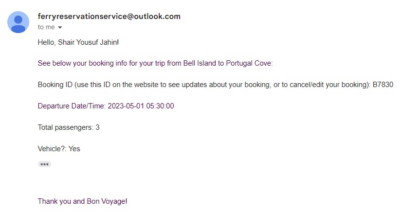
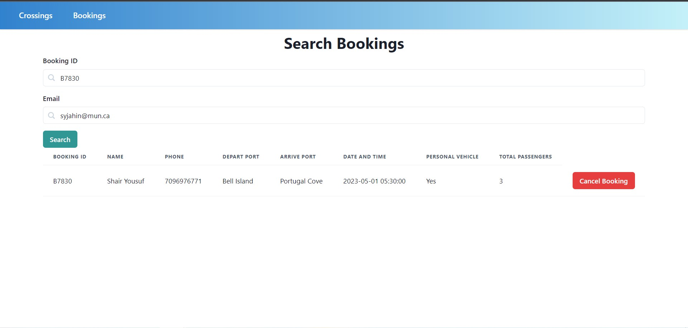
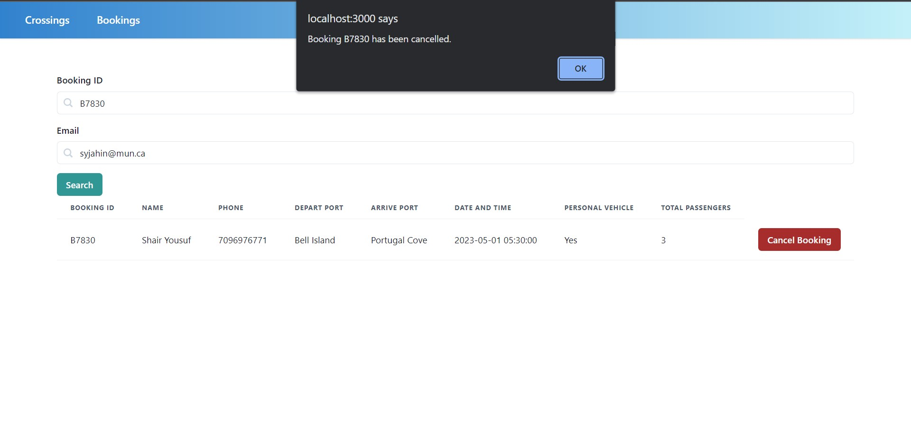
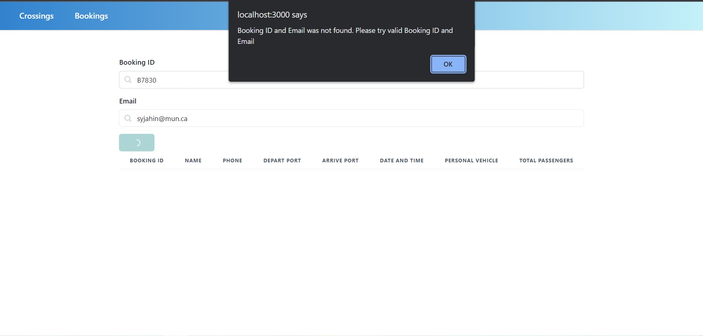

# Demo Screenshots

See screenshots and respective use cases in case the project does not build on your machine.

### Crossings Page

See below the crossings page, where users can input their desired ports and dates to filter the database.

### Booking Form

See below the booking form, which pops up when users click "Book!".

### Email Confirmation

See below the confirmation email, which gets sent to the user once they click "Place Reservation".

### Check Reservation

See below the functionality for checking a booking, using the reservation number and customer email.

### Cancel Booking

See below the functionality for cancelling a booking on the check reservation page. Users are notified of the cancel through an alert (Picture 1), and afterwards the booking no longer exists if searched for (Picture 2).

